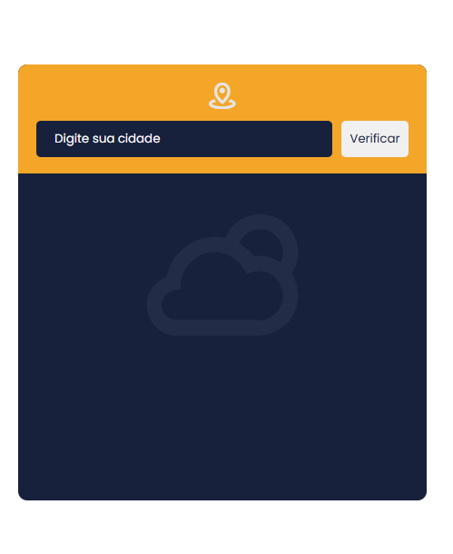
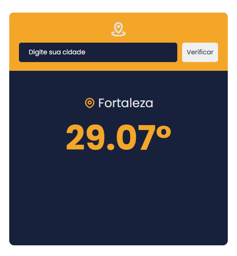
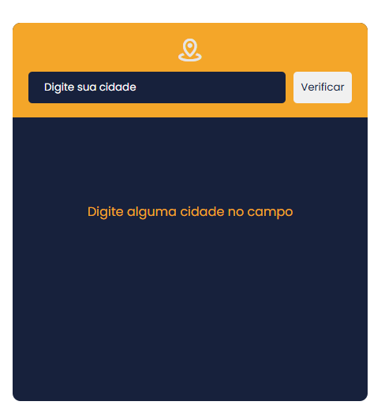

# Aplicativo-de-Clima(Weather App)
Aplicação que verifica o clima da cidade selecionada pelo user. Tudo isso feito em Javascritpt  e usando a OpenWeather API.

 

Acesse o app <a href="https://weslleyfeitosadev.github.io/Aplicativo-de-Clima-Weather-App-/conteudo/">por aqui</a>

 

Parte principal

 

Parte Do Clima

 

Parte Do Error

 

Parte em Branco

